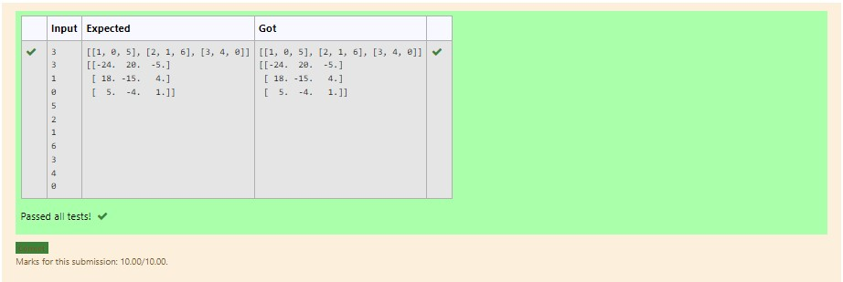

# Inverse-of-matrix

## AIM:
To write python programming for finding the inverse of the matrix.
## ALGORITHM:
# Step 1:
Import numpy as np
# Step 2:
Give the input matrices
# Step 3:
Use forloop,range functiion and append
# Step 4:
Give the inverse formula
# Step 5:
Run the program


## PROGRAM:
```
import numpy as np
l1,l2=[],[]
n1,n2=int(input()),int(input())
for i in range(n1):
    for j in range(n2):
        values=int(input())
        l1.append(values)
    l2.append(l1)
    l1=[]
print(l2)
matrix=np.array(l2)
inverse=np.linalg.inv(matrix)
print(inverse)
```

## OUTPUT:

## RESULT:
Thus program is written to find the inverse of the matrix.
